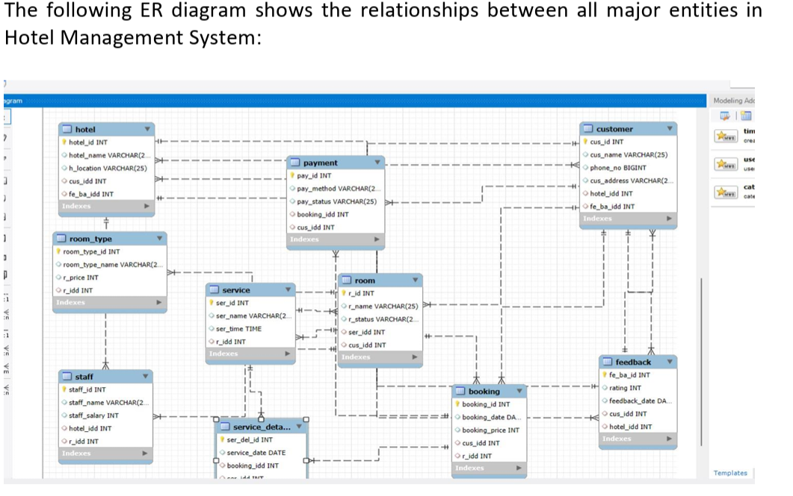

# Hotel Management System

## 📖 Description
The Hotel Management System is a database project developed using SQL to manage hotel operations efficiently. It stores and manages customer details, room information, bookings, and payments in a structured database.

## 🚀 Technologies Used
- SQL
- MySQL

## ✨ Features
- Customer Registration
- Room Management
- Room Booking
- Check-in and Check-out
- Payment Management
- Booking Records
- Customer Information Storage

## 📂 Database Tables
- Customer
- Room
- Booking
- Payment

## ▶️ How to Run
1. Install MySQL or any SQL database software.
2. Open the SQL script file.
3. Execute the queries to create the database and tables.
4. Insert sample data.
5. Run SQL queries to manage hotel records.

## 📸 Screenshots
You can upload screenshots of your database tables or query results here.

Example:

## 🎯 Learning Outcomes
- Learned SQL database design.
- Implemented CRUD (Create, Read, Update, Delete) operations.
- Used primary keys and foreign keys.
- Practiced SQL queries, joins, and constraints.

## 👩‍💻 Author
**Vasudha Yepuri**
